# Execution Modes

Torc supports three execution modes that determine how jobs are launched and managed. The execution
mode affects resource enforcement, job termination, and integration with cluster schedulers like
Slurm.

## Overview

| Mode     | Description                                                                  |
| -------- | ---------------------------------------------------------------------------- |
| `direct` | Torc manages job execution directly without Slurm step wrapping (default)    |
| `slurm`  | Jobs are wrapped with `srun`, letting Slurm manage resources and termination |
| `auto`   | Selects `slurm` if `SLURM_JOB_ID` is set, otherwise `direct`                 |

Configure the execution mode in your workflow specification:

```yaml
execution_config:
  mode: direct  # or "slurm" or "auto"
```

> **Warning**: Use `auto` with caution. If your workflow runs inside a Slurm allocation (where
> `SLURM_JOB_ID` is set), `auto` will silently select slurm mode, which wraps every job with `srun`.
> This may not be what you want if your workflow is designed for direct execution. Prefer setting
> the mode explicitly to avoid surprises.

## When to Use Each Mode

### Direct Mode (Default)

Direct mode is the default and works everywhere: local machines, cloud VMs, containers, and inside
Slurm allocations. Use direct mode when:

- Running jobs **outside of Slurm** (local machine, cloud VMs, containers)
- Running inside Slurm but **srun has compatibility issues** with your environment
- You want the **simplest, most portable** configuration
- You want to run jobs **without resource limits** (`limit_resources: false`) to explore resource
  requirements for new workloads

Direct mode is recommended as the starting point for most workflows. It avoids the overhead of
creating Slurm job steps and works consistently across different HPC sites with varying Slurm
configurations.

### Slurm Mode

Use slurm mode when you need features that only Slurm can provide:

- **Hardware-level resource control**: Slurm's cgroup enforcement can be more precise than Torc's
  process-level monitoring, especially for GPU isolation and CPU binding on newer hardware
- **Per-job accounting**: Each job appears as a separate step in `sacct`, giving detailed resource
  usage breakdowns per job rather than a single entry for the whole Torc worker allocation
- **Admin visibility**: HPC admins can see and manage individual job steps via Slurm tools
  (`squeue`, `sacct`, `scontrol`), which is useful for debugging and auditing
- **Cgroup-based memory enforcement**: Slurm's cgroup limits provide hard memory boundaries with no
  sampling delay, compared to Torc's periodic polling in direct mode
- **CPU binding**: `srun` can bind tasks to specific CPU cores (`enable_cpu_bind: true`), which may
  improve cache locality for CPU-intensive workloads

> **Note**: Some HPC sites may prefer one mode over the other. Check with your site admins if you
> are uncertain which mode to use.

## Direct Mode

In direct mode, Torc spawns job processes directly and manages their lifecycle without Slurm
integration.

### Resource Enforcement

When `limit_resources: true` (the default), Torc enforces resource limits:

- **Memory limits**: The resource monitor periodically samples job memory usage. If a job exceeds
  its configured memory limit, Torc sends SIGKILL and sets the exit code to `oom_exit_code` (default
  137).

- **CPU limits**: CPU counts are tracked for job scheduling but not enforced at the process level.
  Jobs may use more CPUs than requested.

- **GPU allocation**: GPU counts are tracked for scheduling. In direct mode, GPU access depends on
  system configuration (e.g., `CUDA_VISIBLE_DEVICES`).

### Termination Timeline

When a job runner reaches its `end_time` or receives a termination signal, Torc follows this
timeline:

```
end_time - sigkill_headroom - sigterm_lead:  Send termination_signal (default: SIGTERM)
                                              ↓
                              Wait sigterm_lead_seconds (default: 30s)
                                              ↓
end_time - sigkill_headroom:                 Send SIGKILL to remaining jobs
                                              ↓
                              Wait for processes to exit
                                              ↓
end_time:                                    Job runner exits
```

This gives jobs time to:

1. Receive SIGTERM and perform graceful cleanup (checkpoint, flush buffers)
2. Exit voluntarily before SIGKILL
3. Be forcefully terminated if they don't respond

### OOM Detection

The resource monitor runs in a background thread, sampling job memory usage at the configured
interval (default: 1 second in `time_series` mode). When a job's memory exceeds its limit:

1. An OOM violation is detected and logged
2. SIGKILL is sent to the job process
3. The exit code is set to `oom_exit_code` (default: 137 = 128 + SIGKILL)
4. Job status is set to `Failed`

OOM detection requires:

- `limit_resources: true`
- Resource monitor enabled (`resource_monitor.enabled: true`)
- Job has a memory limit in its `resource_requirements`

**Detection Latency**: OOM violations are detected on sample boundaries, so there is inherent
latency up to the `sample_interval_seconds` value (default: 10 seconds). A memory spike could
persist for up to one sample interval before detection. For memory-constrained environments where
faster detection is needed, reduce the sample interval:

```yaml
resource_monitor:
  enabled: true
  granularity: time_series
  sample_interval_seconds: 1  # Check every second
```

Note that `sample_interval_seconds` is an integer (fractional seconds are not supported). More
frequent sampling increases CPU overhead. For most workloads, the default 10-second interval
provides a good balance between detection speed and overhead.

### Direct Mode Configuration

```yaml
execution_config:
  mode: direct
  limit_resources: true        # Enforce memory limits (default: true)
  termination_signal: SIGTERM  # Signal sent before SIGKILL
  sigterm_lead_seconds: 30     # Seconds between SIGTERM and SIGKILL
  sigkill_headroom_seconds: 60 # Seconds before end_time for SIGKILL
  timeout_exit_code: 152       # Exit code for timed-out jobs
  oom_exit_code: 137           # Exit code for OOM-killed jobs
```

## Slurm Mode

In slurm mode, each job is wrapped with `srun`, creating a Slurm job step. This provides:

- **Cgroup isolation**: Slurm enforces CPU and memory limits via cgroups
- **Accounting**: Job steps appear in `sacct` with resource usage metrics
- **Admin visibility**: HPC admins can see and manage steps via Slurm tools
- **Automatic cleanup**: Slurm terminates steps when the allocation ends

### How srun Wrapping Works

When a job starts, Torc builds an srun command:

```bash
srun --jobid=<allocation_id> \
     --ntasks=1 \
     --exact \
     --job-name=wf<workflow_id>_j<job_id>_r<run_id>_a<attempt_id> \
     --nodes=<num_nodes> \
     --cpus-per-task=<num_cpus> \
     --mem=<memory>M \
     --gpus=<num_gpus> \
     --time=<remaining_minutes> \
     --signal=<srun_termination_signal> \
     bash -c "<job_command>"
```

Key flags:

- `--exact`: Use exactly the requested resources, allowing multiple steps to share nodes
- `--time`: Set to `remaining_time - sigkill_headroom` so steps timeout before the allocation ends
- `--signal`: Send a warning signal before step timeout (e.g., `TERM@120` sends SIGTERM 120s before)

### Resource Enforcement in Slurm Mode

Slurm mode always passes `--cpus-per-task`, `--mem`, and `--gpus` to srun. Slurm's cgroups enforce
these limits: jobs exceeding memory are killed by Slurm with exit code 137.

> **Note**: `limit_resources: false` is not supported in Slurm mode. If you need to run jobs without
> resource enforcement inside a Slurm allocation, use `mode: direct` instead. See
> [Disabling Resource Limits](#disabling-resource-limits) below.

### Slurm Mode Configuration

```yaml
execution_config:
  mode: slurm
  srun_termination_signal: TERM@120  # Send SIGTERM 120s before step timeout
  sigkill_headroom_seconds: 180    # End steps 3 minutes before allocation ends
  enable_cpu_bind: false           # Set to true to enable Slurm CPU binding
```

### Step Timeout vs Allocation End

The `sigkill_headroom_seconds` setting creates a buffer between step timeouts and allocation end:

```mermaid
gantt
    title Step Timeout vs Allocation End
    dateFormat X
    axisFormat %s

    section Allocation
    Full allocation           :active, 0, 100

    section Job Step
    Job step runs             :done, 0, 70

    section Timing
    sigkill_headroom_seconds  :crit, 70, 100
    Step timeout (--time=remaining - headroom) :milestone, 70, 70
```



This ensures:

1. Steps timeout with Slurm's `TIMEOUT` status (exit code 152)
2. The job runner has time to collect results and report to the server
3. The allocation doesn't end while jobs are still running

## Disabling Resource Limits

Set `limit_resources: false` to disable resource enforcement in direct mode:

```yaml
execution_config:
  mode: direct
  limit_resources: false
```

This is useful when exploring resource requirements for new jobs or during local development. Jobs
can use any available system resources without being killed for exceeding their declared limits.

Effects in direct mode:

| Feature             | limit_resources: true     | limit_resources: false |
| ------------------- | ------------------------- | ---------------------- |
| Memory limits       | OOM detection and SIGKILL | No enforcement         |
| Timeout termination | Enforced                  | Enforced               |

> **Important**: `limit_resources: false` is only supported in direct mode. Setting it with
> `mode: slurm` will produce an error at workflow creation time. Slurm mode relies on `srun` with
> `--exact`, `--cpus-per-task`, and `--mem` for correct concurrent job execution — omitting these
> flags causes jobs to run sequentially instead of in parallel.

## Exit Codes

Torc uses specific exit codes to identify termination reasons:

| Exit Code | Meaning                    | Default | Configuration Key   |
| --------- | -------------------------- | ------- | ------------------- |
| 137       | OOM killed (128 + SIGKILL) | Yes     | `oom_exit_code`     |
| 152       | Timeout (Slurm convention) | Yes     | `timeout_exit_code` |

These match Slurm's conventions, making it easy to handle failures consistently across execution
modes.

## Example Configurations

### Local Development

```yaml
execution_config:
  mode: direct
  limit_resources: false  # Don't enforce limits during development
```

### Production HPC (with Slurm integration)

```yaml
execution_config:
  mode: slurm
  srun_termination_signal: TERM@120
  sigkill_headroom_seconds: 300
```

### Graceful Shutdown with Custom Signal

```yaml
execution_config:
  mode: direct
  termination_signal: SIGINT  # Send SIGINT instead of SIGTERM
  sigterm_lead_seconds: 60    # Give jobs 60s to handle SIGINT
  sigkill_headroom_seconds: 90
```

### Strict Memory Enforcement

```yaml
resource_monitor:
  enabled: true
  granularity: time_series
  sample_interval_seconds: 1

execution_config:
  mode: direct
  limit_resources: true
  oom_exit_code: 137
```

## Monitoring and Debugging

### Check Execution Mode

The job runner logs the effective execution mode at startup:

```
INFO Job runner starting workflow_id=1 ... execution_mode=Direct limit_resources=true
```

### View Termination Events

Termination events are logged with context:

```
INFO Jobs terminating workflow_id=1 count=3
INFO Job SIGTERM workflow_id=1 job_id=42
INFO Waiting 30s for graceful termination before SIGKILL
INFO Job SIGKILL workflow_id=1 job_id=42
```

### OOM Violations

OOM violations are logged with memory details:

```
WARN OOM violation detected: workflow_id=1 job_id=42 pid=12345 memory=2.50GB limit=2.00GB
WARN Killing OOM job workflow_id=1 job_id=42
```

## Related Documentation

- [Resource Requirements](../reference/resources.md) - Configuring job resource limits
- [Resource Monitoring](../monitoring/resource-monitoring.md) - Enabling the resource monitor
- [Workflow Specification](../reference/workflow-spec.md) - Full execution_config reference
- [Graceful Job Termination](../../specialized/fault-tolerance/checkpointing.md) - Handling
  termination signals in jobs
