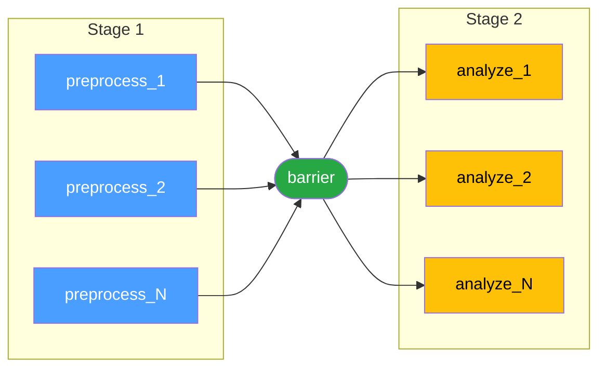

# Multi-Stage Workflows with Barriers

This tutorial teaches you how to efficiently structure workflows with multiple stages using the
**barrier pattern**. This is essential for scaling workflows to thousands of jobs.

## Learning Objectives

By the end of this tutorial, you will:

- Understand the quadratic dependency problem in multi-stage workflows
- Use barrier jobs to efficiently synchronize between stages
- Scale workflows to thousands of jobs with minimal overhead
- Know when to use barriers vs. direct dependencies

## Prerequisites

- Basic understanding of Torc workflows
- Completed the [Many Independent Jobs](./many-jobs.md) tutorial
- Completed the [Simple Parameterization](./simple-params.md) tutorial

## The Problem: Quadratic Dependencies

Let's start with a common but inefficient pattern. Suppose you want to:

1. **Stage 1**: Run 1000 preprocessing jobs in parallel
2. **Stage 2**: Run 1000 analysis jobs, but only after **ALL** stage 1 jobs complete
3. **Stage 3**: Run a final aggregation job

### Naive Approach (DON'T DO THIS!)

```yaml
name: "Inefficient Multi-Stage Workflow"
description: "This creates 1,000,000 dependencies!"

jobs:
  # Stage 1: 1000 preprocessing jobs
  - name: "preprocess_{i:03d}"
    command: "python preprocess.py --id {i}"
    parameters:
      i: "0:999"

  # Stage 2: Each analysis job waits for ALL preprocessing jobs
  - name: "analyze_{i:03d}"
    command: "python analyze.py --id {i}"
    depends_on_regexes: ["^preprocess_.*"]  # ⚠️ Creates 1,000,000 dependencies!
    parameters:
      i: "0:999"

  # Stage 3: Final aggregation
  - name: "final_report"
    command: "python generate_report.py"
    depends_on_regexes: ["^analyze_.*"]  # ⚠️ Creates 1,000 more dependencies
```

### Why This is Bad

When Torc expands this workflow:

- Each of the 1000 `analyze_*` jobs gets a dependency on each of the 1000 `preprocess_*` jobs
- **Total dependencies: 1000 × 1000 = 1,000,000 relationships**
- Workflow creation takes **minutes** instead of seconds
- Database becomes bloated with dependency records
- Job initialization is slow

## The Solution: Barrier Jobs

A **barrier job** is a lightweight synchronization point that:

- Depends on all jobs from the previous stage (using a regex)
- Is depended upon by all jobs in the next stage
- Reduces dependencies from O(n²) to O(n)



Instead of N×N dependencies (every stage 2 job depending on every stage 1 job), you get 2N
dependencies (N into the barrier, N out of the barrier).

### Efficient Approach (DO THIS!)

```yaml
name: "Efficient Multi-Stage Workflow"
description: "Uses barrier pattern with only ~3000 dependencies"

jobs:
  # ═══════════════════════════════════════════════════════════
  # STAGE 1: Preprocessing (1000 parallel jobs)
  # ═══════════════════════════════════════════════════════════
  - name: "preprocess_{i:03d}"
    command: "python preprocess.py --id {i} --output data/stage1_{i:03d}.json"
    resource_requirements: "medium"
    parameters:
      i: "0:999"

  # ═══════════════════════════════════════════════════════════
  # BARRIER: Wait for ALL stage 1 jobs
  # ═══════════════════════════════════════════════════════════
  - name: "barrier_stage1_complete"
    command: "echo 'Stage 1 complete: 1000 files preprocessed' && date"
    resource_requirements: "tiny"
    depends_on_regexes: ["^preprocess_.*"]  # ✓ 1000 dependencies

  # ═══════════════════════════════════════════════════════════
  # STAGE 2: Analysis (1000 parallel jobs)
  # ═══════════════════════════════════════════════════════════
  - name: "analyze_{i:03d}"
    command: "python analyze.py --input data/stage1_{i:03d}.json --output data/stage2_{i:03d}.csv"
    resource_requirements: "large"
    depends_on: ["barrier_stage1_complete"]  # ✓ 1000 dependencies (one per job)
    parameters:
      i: "0:999"

  # ═══════════════════════════════════════════════════════════
  # BARRIER: Wait for ALL stage 2 jobs
  # ═══════════════════════════════════════════════════════════
  - name: "barrier_stage2_complete"
    command: "echo 'Stage 2 complete: 1000 analyses finished' && date"
    resource_requirements: "tiny"
    depends_on_regexes: ["^analyze_.*"]  # ✓ 1000 dependencies

  # ═══════════════════════════════════════════════════════════
  # STAGE 3: Final report (single job)
  # ═══════════════════════════════════════════════════════════
  - name: "final_report"
    command: "python generate_report.py --output final_report.html"
    resource_requirements: "medium"
    depends_on: ["barrier_stage2_complete"]  # ✓ 1 dependency

resource_requirements:
  - name: "tiny"
    num_cpus: 1
    num_gpus: 0
    num_nodes: 1
    memory: "100m"
    runtime: "PT1M"

  - name: "medium"
    num_cpus: 4
    num_gpus: 0
    num_nodes: 1
    memory: "4g"
    runtime: "PT30M"

  - name: "large"
    num_cpus: 16
    num_gpus: 1
    num_nodes: 1
    memory: "32g"
    runtime: "PT2H"
```

### Dependency Breakdown

**Without barriers:**

- Stage 1 → Stage 2: 1000 × 1000 = **1,000,000 dependencies**
- Stage 2 → Stage 3: 1000 = **1,000 dependencies**
- **Total: 1,001,000 dependencies**

**With barriers:**

- Stage 1 → Barrier 1: **1,000 dependencies**
- Barrier 1 → Stage 2: **1,000 dependencies**
- Stage 2 → Barrier 2: **1,000 dependencies**
- Barrier 2 → Stage 3: **1 dependency**
- **Total: 3,001 dependencies** ← **333× improvement!**

## Step-by-Step: Creating Your First Barrier Workflow

Let's create a simple 2-stage workflow.

### Step 1: Create the Workflow Spec

Create `barrier_demo.yaml`:

```yaml
name: "Barrier Pattern Demo"
description: "Simple demonstration of the barrier pattern"

jobs:
  # Stage 1: Generate 100 data files
  - name: "generate_data_{i:02d}"
    command: "echo 'Data file {i}' > output/data_{i:02d}.txt"
    parameters:
      i: "0:99"

  # Barrier: Wait for all data generation
  - name: "data_generation_complete"
    command: "echo 'All 100 data files generated' && ls -l output/ | wc -l"
    depends_on_regexes: ["^generate_data_.*"]

  # Stage 2: Process each data file
  - name: "process_data_{i:02d}"
    command: "cat output/data_{i:02d}.txt | wc -w > output/processed_{i:02d}.txt"
    depends_on: ["data_generation_complete"]
    parameters:
      i: "0:99"

  # Final barrier and report
  - name: "processing_complete"
    command: "echo 'All 100 files processed' && cat output/processed_*.txt | awk '{sum+=$1} END {print sum}'"
    depends_on_regexes: ["^process_data_.*"]
```

### Step 2: Create the Output Directory

```bash
mkdir -p output
```

### Step 3: Create the Workflow

```bash
torc create barrier_demo.yaml
```

You should see output like:

```
Created workflow with ID: 1
- Created 100 stage 1 jobs
- Created 1 barrier job
- Created 100 stage 2 jobs
- Created 1 final barrier
Total: 202 jobs, 201 dependencies
```

Compare this to **10,000 dependencies** without barriers!

### Step 4: Run the Workflow

```bash
torc run 1
```

### Step 5: Monitor Progress

```bash
torc tui
```

You'll see:

1. All 100 `generate_data_*` jobs run in parallel
2. Once they finish, `data_generation_complete` executes
3. Then all 100 `process_data_*` jobs run in parallel
4. Finally, `processing_complete` executes

## Making Effective Barrier Jobs

### 1. Keep Barriers Lightweight

Barriers should be quick and cheap:

```yaml
✓ GOOD - Lightweight logging
- name: "stage1_complete"
  command: "echo 'Stage 1 done' && date"
  resource_requirements: "tiny"

✗ BAD - Heavy computation
- name: "stage1_complete"
  command: "python expensive_validation.py"  # Don't do this!
  resource_requirements: "large"
```

If you need validation, create a separate job:

```yaml
# Barrier - lightweight
- name: "stage1_complete"
  command: "echo 'Stage 1 done'"
  resource_requirements: "tiny"
  depends_on_regexes: ["^stage1_.*"]

# Validation - heavier
- name: "validate_stage1"
  command: "python validate_all_outputs.py"
  resource_requirements: "medium"
  depends_on: ["stage1_complete"]

# Stage 2 depends on validation passing
- name: "stage2_job_{i}"
  command: "python stage2.py {i}"
  depends_on: ["validate_stage1"]
  parameters:
    i: "0:999"
```

### 2. Use Descriptive Names

Names should clearly indicate what stage completed:

```yaml
✓ GOOD
- name: "barrier_preprocessing_complete"
- name: "barrier_training_complete"
- name: "all_simulations_finished"

✗ BAD
- name: "barrier1"
- name: "sync"
- name: "wait"
```

### 3. Add Useful Information

Make barriers informative:

```yaml
- name: "preprocessing_complete"
  command: |
    echo "════════════════════════════════════════"
    echo "Preprocessing Complete: $(date)"
    echo "Files generated: $(ls output/stage1_*.json | wc -l)"
    echo "Total size: $(du -sh output/)"
    echo "Proceeding to analysis stage..."
    echo "════════════════════════════════════════"
  depends_on_regexes: ["^preprocess_.*"]
```

### 4. Be Careful with Regex Patterns

Ensure your regex matches exactly what you intend:

```yaml
✓ GOOD - Anchored patterns
depends_on_regexes: ["^stage1_job_.*"]      # Matches "stage1_job_001", "stage1_job_042"
depends_on_regexes: ["^preprocess_\\d+$"]   # Matches "preprocess_0", "preprocess_999"

✗ BAD - Too broad
depends_on_regexes: ["stage1"]              # Matches "my_stage1_test" (unintended!)
depends_on_regexes: [".*"]                  # Matches EVERYTHING (disaster!)
```

Test your regex before deploying:

```bash
# Python regex tester
python3 -c "import re; print(re.match(r'^stage1_job_.*', 'stage1_job_001'))"
```

## When NOT to Use Barriers

Barriers are not always the right solution:

### 1. One-to-One Dependencies

When each job in stage 2 only needs its corresponding stage 1 job:

```yaml
# DON'T use a barrier here
jobs:
  - name: "preprocess_{i}"
    command: "preprocess.py {i}"
    output_files: ["data_{i}.json"]
    parameters:
      i: "0:99"

  # Each analysis only needs its own preprocessed file
  - name: "analyze_{i}"
    command: "analyze.py {i}"
    input_files: ["data_{i}.json"]  # ✓ Automatic dependency via files
    parameters:
      i: "0:99"
```

The file dependency system already handles this efficiently!

### 2. Specific Dependencies in DAGs

When you have a directed acyclic graph (DAG) with specific paths:

```yaml
# Diamond pattern - specific dependencies
jobs:
  - name: "fetch_data"
    command: "fetch.py"

  - name: "process_weather"
    command: "process_weather.py"
    depends_on: ["fetch_data"]

  - name: "process_traffic"
    command: "process_traffic.py"
    depends_on: ["fetch_data"]

  - name: "generate_report"
    command: "report.py"
    depends_on: ["process_weather", "process_traffic"]  # ✓ Specific dependencies
```

Don't force this into stages - the specific dependencies are clearer!

### 3. Small Workflows

For small workflows (< 100 jobs), the overhead of barriers isn't worth it:

```yaml
# Only 10 jobs - barriers not needed
jobs:
  - name: "job_{i}"
    command: "process.py {i}"
    depends_on_regexes: ["^prepare_.*"]  # This is fine for 10 jobs
    parameters:
      i: "0:9"
```

## Scaling to Thousands of Jobs

The barrier pattern scales beautifully. Let's compare performance:

| Stage 1 Jobs | Stage 2 Jobs | Without Barriers         | With Barriers      | Speedup |
| ------------ | ------------ | ------------------------ | ------------------ | ------- |
| 100          | 100          | 10,000 deps (~1s)        | 200 deps (<0.1s)   | 10×     |
| 1,000        | 1,000        | 1,000,000 deps (~45s)    | 2,000 deps (~0.5s) | 90×     |
| 10,000       | 10,000       | 100,000,000 deps (hours) | 20,000 deps (~5s)  | 1000×+  |

As you can see, barriers become **essential** for large-scale workflows.

## Complete Example

See
[multi_stage_barrier_pattern.yaml](https://github.com/NatLabRockies/torc/blob/main/examples/yaml/multi_stage_barrier_pattern.yaml)
for a comprehensive example with:

- 3 distinct stages (1000 → 1000 → 100 jobs)
- Informative barrier jobs with progress logging
- Different resource requirements per stage
- Comments explaining the pattern

## Summary

✓ **Use barrier jobs** when all jobs in one stage must complete before any job in the next stage
starts

✓ **Use file/data dependencies** for one-to-one job relationships

✓ **Use specific dependencies** for DAG patterns with clear paths

✓ **Keep barriers lightweight** - just logging and simple checks

✓ **Use descriptive names** to track workflow progress

The barrier pattern is your key to scaling Torc workflows from hundreds to thousands of jobs
efficiently!

## Next Steps

- Try modifying the demo workflow to have 3 or more stages
- Experiment with adding validation logic to barrier jobs
- Check out [Advanced Parameterization](./advanced-params.md) for creating complex multi-stage
  pipelines
- Learn about [Workflow Actions](../../specialized/design/workflow-actions.md) for conditional
  execution between stages
