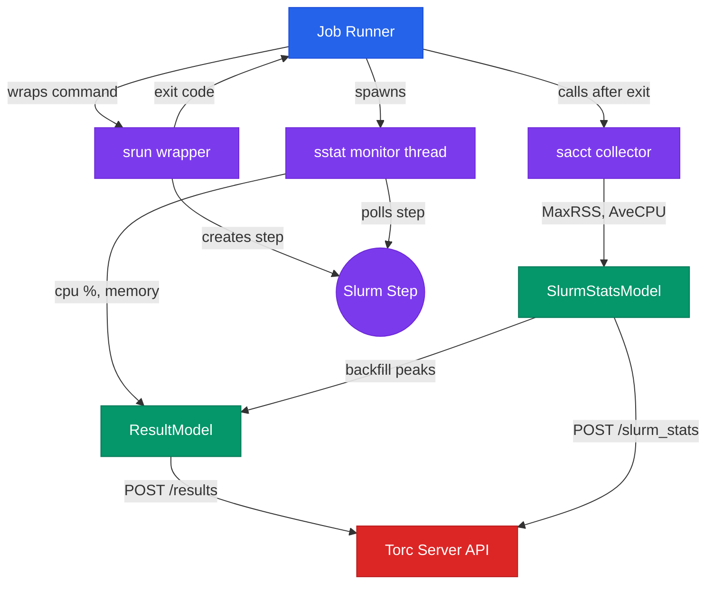
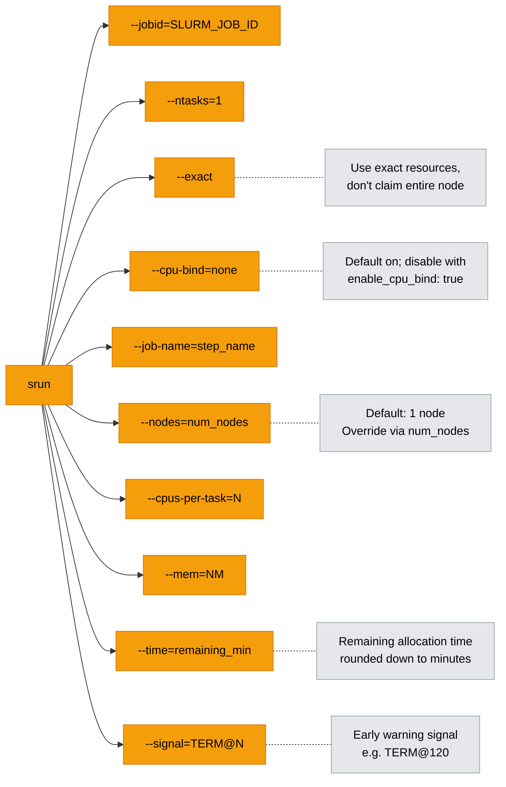
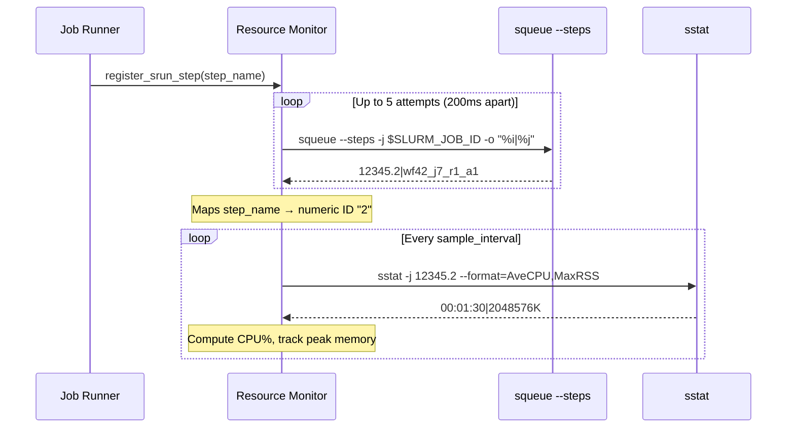
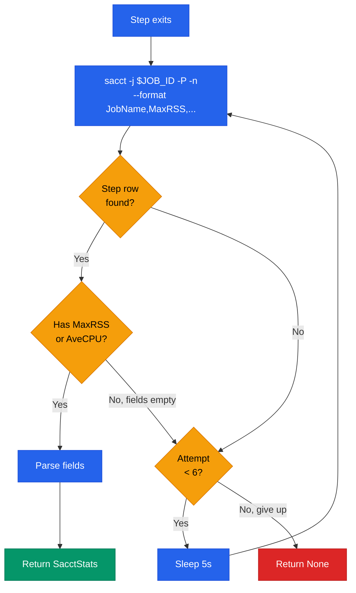
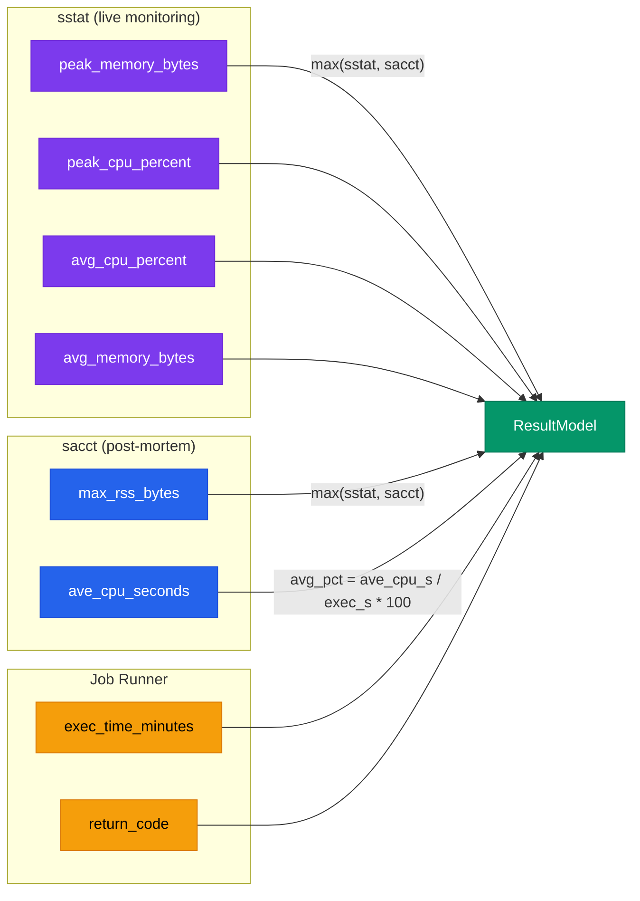
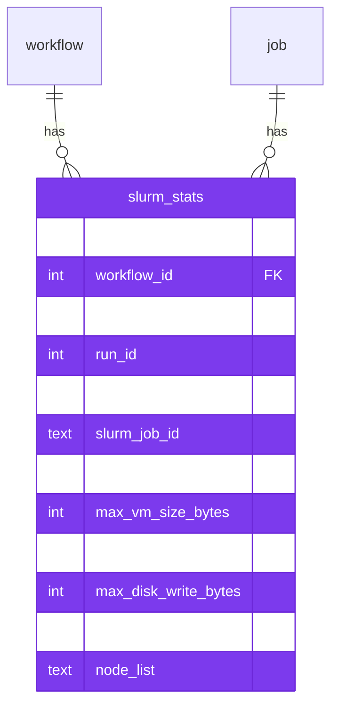

# Slurm Job Step Monitoring

Torc automatically wraps workflow jobs with `srun` when running inside a Slurm allocation, creating
per-job steps with cgroup enforcement. It then monitors live resource usage via `sstat` and collects
final accounting data via `sacct`. This page describes the architecture and data flow.

## Overview

When a Torc job runner detects `SLURM_JOB_ID` in the environment, it activates three subsystems:

1. **srun wrapping** -- creates a Slurm job step per workflow job
2. **sstat monitoring** -- polls live CPU and memory usage during execution
3. **sacct collection** -- retrieves final accounting data after completion

These work together to provide accurate resource metrics for recovery heuristics, resource
correction, and reporting.



## srun Wrapping

**Module:** `src/client/async_cli_command.rs`

When `SLURM_JOB_ID` is set, `AsyncCliCommand::start()` wraps the user's command with `srun` instead
of running it directly via the shell. This gives each workflow job its own Slurm step with cgroup
isolation.

### Step Naming Convention

Each step is named with a deterministic pattern that enables unambiguous sacct lookup:

```
wf{workflow_id}_j{job_id}_r{run_id}_a{attempt_id}
```

Example: `wf42_j7_r1_a1` -- workflow 42, job 7, run 1, attempt 1.

### srun Arguments



| Argument          | Purpose                                                                       |
| ----------------- | ----------------------------------------------------------------------------- |
| `--jobid`         | Binds step to the parent Slurm allocation                                     |
| `--ntasks=1`      | One task per workflow job                                                     |
| `--exact`         | Use exactly the requested resources; don't claim the entire node exclusively  |
| `--cpu-bind=none` | Disables CPU affinity binding (default; omitted when `enable_cpu_bind: true`) |
| `--job-name`      | Sets the step name for sacct/sstat lookup                                     |
| `--nodes`         | Number of nodes for this step (from `num_nodes`, default 1)                   |
| `--cpus-per-task` | CPU cgroup limit (only when `limit_resources=true`)                           |
| `--mem`           | Memory cgroup limit in MB (only when `limit_resources=true`)                  |
| `--time`          | Per-step walltime from remaining allocation time (see below)                  |
| `--signal`        | Early warning signal before step timeout (see below)                          |

### Multi-Node Steps

The `num_nodes` field on resource requirements controls how many nodes an srun step spans
(`srun --nodes`). It defaults to 1. The allocation size (`sbatch --nodes`) is set via the Slurm
scheduler configuration.

- **Single-node jobs** (default): `num_nodes=1` -- each job runs on one node
- **Multi-node jobs** (MPI, Julia Distributed.jl): `num_nodes=N` -- step spans N nodes

When `num_nodes > 1`, Torc treats the job as consuming whole nodes exclusively for the lifetime of
the step. This avoids ambiguous partial-node accounting for MPI and other true multi-node jobs.

### The `limit_resources` Flag

When `limit_resources` is enabled in the scheduler configuration, srun applies `--cpus-per-task` and
`--mem` flags. This creates cgroup-enforced limits: jobs exceeding their memory allocation are
killed by the OOM killer (exit code 137), and CPU usage is throttled.

Without `limit_resources`, Slurm still creates per-step accounting but does not enforce hard limits.

### Per-Step Walltime (`--time`)

Torc sets `srun --time=<remaining_minutes>` on every step, where `remaining_minutes` is the time
left in the Slurm allocation (rounded **down** to whole minutes, minimum 1). This ensures that when
a step exceeds its time, Slurm produces a clean `State=TIMEOUT` with return code 152, rather than
`State=CANCELLED` which is what happens when the allocation itself expires and kills the step.

The rounding-down is intentional: it guarantees the step's timeout fires **before** the allocation
expires, so Torc can detect the timeout via sacct and report it accurately.

### Early Termination Signal (`--signal`)

When the workflow has `srun_termination_signal` set (e.g., `"TERM@120"`), Torc passes
`srun --signal=TERM@120` to every step. This tells Slurm to send SIGTERM to the job process 120
seconds **before** the step's `--time` limit. The job can catch this signal, save a checkpoint, and
exit cleanly before the hard kill.

This is a workflow-level setting stored in the database and applied uniformly to all srun
invocations. See the [Graceful Job Termination tutorial](../fault-tolerance/checkpointing.md) for a
complete example with a Python signal handler.

### Memory vs Runtime Enforcement

Memory and runtime are handled differently because they carry different risks:

- **Memory (`--mem`)** enforces a **per-job cgroup limit** based on the job's own resource
  requirements. A job that exceeds its declared memory is killed by the OOM killer (exit code 137).
  This strict enforcement is necessary because a runaway memory consumer can destabilize the entire
  node by starving other concurrent jobs of memory.

- **Runtime (`--time`)** is set to the **remaining allocation time**, not the job's declared
  `runtime` from resource requirements. This ensures Slurm produces a clean `State=TIMEOUT` (return
  code 152) instead of `State=CANCELLED` when time runs out. The per-step `--time` is not derived
  from the job's resource requirements because, unlike excess memory usage, a long-running job does
  not endanger other jobs — it simply runs longer than expected. Killing a job at 95% completion
  because it slightly exceeded its estimated runtime would waste all the compute invested.

## sstat Monitoring

**Module:** `src/client/resource_monitor.rs`

The resource monitor spawns a background thread that periodically polls `sstat` for live resource
metrics. This provides time-series data for CPU and memory usage during job execution.

### Step ID Discovery

sstat requires numeric step IDs (e.g., `12345.0`, `12345.1`), not step names. After srun starts, the
monitor discovers the numeric ID:



The `squeue --steps` command is used instead of `scontrol show step` because it produces one compact
line per step, which is critical for allocations with thousands of concurrent steps.

### CPU Percent Calculation

sstat reports `AveCPU` as cumulative CPU time since step start, not instantaneous usage. The monitor
converts this to a utilization percentage:

```
cpu_percent = (new_ave_cpu_s - prev_ave_cpu_s) / elapsed_s * 100.0
```

**First-sample guard:** The first sstat sample is always skipped because there is no previous
baseline to compute a delta from. Without this guard, the first sample would compute
`cumulative_cpu / total_elapsed` which gives an inaccurate average, not instantaneous usage.

### sstat Fields Collected

| sstat Field | Parsed As                 | Stored In             |
| ----------- | ------------------------- | --------------------- |
| `AveCPU`    | Seconds (HH:MM:SS)        | CPU percent (derived) |
| `MaxRSS`    | Bytes (with K/M/G suffix) | `peak_memory_bytes`   |

### Noise Reduction

sstat calls for completed steps return non-zero exit codes. These are logged at `debug` level (not
`warn`) to avoid flooding logs when steps finish between polling intervals.

## sacct Collection

**Module:** `src/client/async_cli_command.rs`

After a job step exits, `collect_sacct_stats()` retrieves the final Slurm accounting record. This is
a blocking call that runs on the job runner thread.

### Retry Logic

The Slurm accounting daemon (`slurmdbd`) often has a delay between step completion and record
availability. The collector retries up to 6 times with 5-second delays:



### sacct Output Format

The command queries sacct with pipe-separated output:

```
sacct -j <slurm_job_id> --format JobName,MaxRSS,MaxVMSize,MaxDiskRead,MaxDiskWrite,AveCPU,NodeList -P -n
```

The step row is matched by `JobName == step_name` in code rather than using sacct's `--name` flag,
which on some Slurm versions matches the allocation name instead of the step name.

### sacct Fields Collected

| sacct Field    | Model Field            | Description                                   |
| -------------- | ---------------------- | --------------------------------------------- |
| `MaxRSS`       | `max_rss_bytes`        | Peak resident set size                        |
| `MaxVMSize`    | `max_vm_size_bytes`    | Peak virtual memory size                      |
| `MaxDiskRead`  | `max_disk_read_bytes`  | Total bytes read from disk                    |
| `MaxDiskWrite` | `max_disk_write_bytes` | Total bytes written to disk                   |
| `AveCPU`       | `ave_cpu_seconds`      | Average CPU time (HH:MM:SS parsed to seconds) |
| `NodeList`     | `node_list`            | Nodes where step ran                          |

## Data Assembly

**Module:** `src/client/job_runner.rs`

The job runner assembles the final `ResultModel` from three sources:



### Backfill Strategy

The `backfill_sacct_into_result()` function merges sacct data into the result, following these
rules:

| Field               | Strategy                              | Rationale                                                                                     |
| ------------------- | ------------------------------------- | --------------------------------------------------------------------------------------------- |
| `peak_memory_bytes` | `max(sstat_peak, sacct_MaxRSS)`       | sstat may miss spikes between samples; sacct may miss brief spikes between accounting flushes |
| `avg_cpu_percent`   | sacct `ave_cpu_s / exec_s * 100`      | Replaces sstat-derived average with sacct's authoritative lifetime average                    |
| `peak_cpu_percent`  | sacct average (only if sstat gave 0%) | sacct has no instantaneous peak; using the average is better than displaying 0%               |
| `avg_memory_bytes`  | sstat only (no backfill)              | sacct provides no average RSS; only the sstat time-series has this                            |

**Zero guards:** sacct values of 0 are skipped during backfill. A zero usually means accounting was
never flushed (very short or failed steps), not that the job used no resources.

## Storage

### SlurmStatsModel

Sacct data is stored in the `slurm_stats` table with a UNIQUE constraint on
`(workflow_id, job_id, run_id, attempt_id)`:



The API provides:

- `POST /slurm_stats` -- store accounting data after step completion
- `GET /slurm_stats?workflow_id=N` -- list stats with optional `job_id`, `run_id`, `attempt_id`
  filters

### ResultModel Integration

The `ResultModel` (stored in the `result` table) holds the merged resource metrics from both sstat
and sacct. These are the fields used by recovery heuristics and resource correction:

- `peak_memory_bytes` -- compared against configured memory limit
- `peak_cpu_percent` -- compared against configured CPU count
- `exec_time_minutes` -- compared against configured runtime
- `avg_cpu_percent` -- displayed in reports and dashboards

## Parsing Utilities

**Module:** `src/client/slurm_utils.rs`

Two parsing functions handle Slurm's non-standard formats:

- **`parse_slurm_memory(s)`** -- parses suffixed memory strings (`1024K`, `2.5G`, `512M`) into bytes
- **`parse_slurm_cpu_time(s)`** -- parses `HH:MM:SS` or `D-HH:MM:SS` timestamps into seconds

These are used by both the sstat monitor and the sacct collector to normalize Slurm output into
numeric values.

## Failure Modes and Recovery

| Failure                  | Impact                                | Handling                             |
| ------------------------ | ------------------------------------- | ------------------------------------ |
| srun not available       | Falls back to direct shell execution  | Detected by `SLURM_JOB_ID` absence   |
| sstat unavailable        | No live metrics; sacct still works    | sstat errors logged at debug level   |
| Step ID not discoverable | sstat monitoring skipped for that job | Retries 5x at 200ms intervals        |
| sacct returns no data    | SlurmStatsModel has NULL fields       | Retries 6x at 5s intervals           |
| sacct reports zeros      | Backfill skips zero values            | Preserves sstat-derived metrics      |
| OOM kill (exit 137)      | Job fails, memory limit detected      | Recovery heuristics increase memory  |
| Timeout (exit 152)       | Job fails, runtime limit detected     | Recovery heuristics increase runtime |

## Configuration

| Setting                   | Location                | Description                                                  |
| ------------------------- | ----------------------- | ------------------------------------------------------------ |
| `limit_resources`         | Scheduler config        | Enable cgroup enforcement via srun `--mem`/`--cpus-per-task` |
| `num_nodes`               | Resource requirements   | Number of nodes per job (default: 1)                         |
| `sample_interval_seconds` | Resource monitor config | sstat polling interval                                       |
| `TORC_FAKE_SRUN`          | Environment variable    | Override srun binary path (testing)                          |
| `TORC_FAKE_SACCT`         | Environment variable    | Override sacct binary path (testing)                         |
